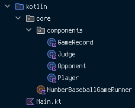

<p align = "center">
    
    
</p>

# N u m b e r B a s e b a l l G a m e
스파르타코딩클럽 내일배움캠프 [`Kotlin` + `Spring`] 트랙 2기 3주차 프로그래밍 과제: 숫자 야구 게임

---

## 목차
0. [개발 환경](#0-개발-환경)
1. [과제 요구사항](#1-과제-요구사항)
   - 1-1. [필수 요소](#1-1-필수-요소)
   - 1-2. [선택 요소](#1-2-선택-요소)
2. [프로그램 흐름도](#2-프로그램-흐름도)
   - 2-1. [기본 흐름](#2-1-기본-흐름)
   - 2-2. [실행 방법](#2-2-실행-방법)
3. [패키지 / 클래스 구조 및 설명](#3-패키지--클래스-구조-및-설명)
    - 3-1. [패키지 구조](#3-1-패키지-구조)
    - 3-2. [클래스 설명](#3-2-클래스-설명)

---

## 0. 개발 환경
| 기준  | 내용                                 |
|-----|------------------------------------|
| OS  | `Windows 11 Home 23H2`             |
| IDE | `IntelliJ IDEA 2024.1`             |
| SDK | `OpenJDK 17.0.3` + `Kotlin 1.9.23` |

---

## 1. 과제 요구사항

### 1-1. 필수 요소
- [v] **서로 다른 _임의의_ 수 3개(1 ~ 9)로 이루어진 3자리 수** 생성
- [v] 사용자로부터 **서로 다른 숫자로 이루어진 3자리 수** 입력
- [v] 사용자가 입력한 수와 생성한 수를 비교하여 판정
  - [v] _동일한 자리_ 에 _같은 숫자_ 가 들어갔을 경우 스트라이크 체크
  - [v] _다른 자리_ 라도 _같은 숫자_ 가 들어갔을 경우 볼 체크
  - [v] 스트라이크 수와 볼 수 출력
- [v] 스트라이크 - 사용자가 입력한 수와 생성한 수가 동일함 - 일 경우 게임 종료

### 1-2. 선택 요소

#### 1-2-1. 게임 메뉴
- [v] **프로그램 시작 시** 안내 문구 출력
- [v] 메뉴 출력 후 사용자로부터 메뉴 선택 입력
- [v] `게임 시작`에 관련된 메뉴를 눌렀을 경우 [필수 요소]에 있는 내용대로 게임 진행

#### 1-2-2. 0도 같이
- [v] **서로 다른 _임의의_ 수 3개(_0_ ~ 9)로 이루어진 3자리 수** 생성 및 입력
- [v] _3자리 수_ 여야 하기에 **맨 앞에 0이 들어오는 수는 포함하지 않음**

#### 1-2-3. 게임 기록
- [v] [선택 요소 > 게임 메뉴]에서 `게임 기록 조회`에 관련된 메뉴를 선택했을 때 **이전에 게임 한 기록 보여주기**

#### 1-2-4. 게임 종료
- [v] [선택 요소 > 게임 종료]에서 `게임 종료`에 관련된 메뉴를 선택했을 때 **프로그램 종료**하기
- [v] _올바르지 않은 메뉴_ 선택에 대한 **오류 메세지 출력**

---

## 2. 프로그램 흐름도

### 2-1. 기본 흐름

`Main.kt`에 적힌 `main`의 흐름을 의사 코드(pseudocode)로 표현했을 땐 다음과 같습니다:
```pseudocode
아래를 *무한히* 반복:
    사용자로부터 메뉴 선택을 입력받는다
    
    `새 게임`을 하자고 했을 경우
        게임을 실행한다
    `게임 기록 보기`를 원할 경우
        이 때 까지 한 게임 기록을 보여준다
    `종료`하자고 했을 경우
        반복을 종료한다
    그것도 아닐 경우
        올바른 메뉴 선택을 하라는 오류 메세지를 출력한다
```

### 2-2. 실행 방법

#### 2-2-1. 기본 메뉴
```
Welcome to the Number Baseball Game!

1. Play a new game | 2. Show previous records | 3. Exit
Tell me what you want to do: 
```

실행 시 반복적으로 위 메세지를 통해 메뉴 선택을 물어봅니다(맨 위의 환영 문구는 *프로그램 시작* 시에만 출력됩니다).

여기서 사용자는 **1 ~ 3의 수를 입력**하여 프로그램을 진행시킬 수 있습니다. 이 범위 밖의 수를 입력했거나 숫자가 아닌 값을 입력했을 경우 오류 메세지를 출력합니다:

```
1. Play a new game | 2. Show previous records | 3. Exit
Tell me what you want to do: 4
Please try again with number within range [1, 3].

1. Play a new game | 2. Show previous records | 3. Exit
Tell me what you want to do: bruh
Error: Invalid input: cannot parse value into int for input string: "bruh"
Please try again with number within range [1, 3].
```

#### 2-2-2. 숫자 야구 게임
```
1. Play a new game | 2. Show previous records | 3. Exit
   Tell me what you want to do: 1

Enter number of your guess:
```

메뉴에서 `새 게임`을 선택했을 경우 새로운 숫자 야구 게임 라운드를 시작합니다. 각 라운드의 흐름을 의사 코드로 표현했을 땐 다음과 같습니다:
```pseudocode
임의의 3자리 수(각 자리의 숫자가 모두 다른 수)를 생성한다
새 기록의 장을 펼친다
사용자가 입력한 수가 생성한 수와 같지 않을 동안 반복한다:
    사용자로부터 수를 입력받는다
    
    사용자가 입력한 수를 기록한다
    
    사용자가 입력한 수와 생성한 수가 같을 경우
        시도 횟수를 알려주며 게임이 끝났음을 알린다
    그렇지 않을 경우
        추측 결과를 스트라이크/볼 형식으로 알려준다
```

```
Enter number of your guess:
```

위 메세지와 함꼐 사용자로부터 수 입력을 기다립니다. 이 때 사용자는 **각 자리수가 모두 다른 3자리 수**를 입력할 수 있습니다. 올바른 수가 입력되었을 경우 생성한 수와 비교하여 판정을 출력합니다.
```
Enter number of your guess: 123
Your guess makes... 0 strike(s), 1 ball(s)

Enter number of your guess: 
```

올바르지 않은 수 - _중복되는 자리수가 있는 3자리 수_ 나 _3자리가 아닌 수_ - 를 입력하거나 숫자가 아닌 다른 값을 입력했을 경우 **오류 메세지를 출력**합니다:
```
Enter number of your guess: black sheep wall
Error: Invalid input: cannot parse value into int for input string: "black sheep wall"
Please try again with 3-digit number with all 3 digits unique.

Enter number of your guess: 1234
Please try again with 3-digit number with all 3 digits unique.

Enter number of your guess: 1123
Please try again with 3-digit number with all 3 digits unique.

Enter number of your guess: 1
Please try again with 3-digit number with all 3 digits unique.

Enter number of your guess: 12
Please try again with 3-digit number with all 3 digits unique.

Enter number of your guess: 
```

이러한 수 입력은 **사용자가 (컴퓨터에서) 생성한 수를 입력하여 맞추기 - 스트라이크 3개 판정이 나기 - 전까지 반복적으로 진행**됩니다. 스트라이크 3개 판정이 났을 경우 **시도 횟수와 함께 게임이 끝났음을 알립니다**.

```
Enter number of your guess: 123
Your guess makes... 0 strike(s), 1 ball(s)

Enter number of your guess: 456
Your guess makes... 0 strike(s), 1 ball(s)

Enter number of your guess: 789
Your guess makes... 0 strike(s), 1 ball(s)

Enter number of your guess: 147
Your guess makes... 1 strike(s), 0 ball(s)

Enter number of your guess: 148
Your guess makes... 1 strike(s), 1 ball(s)

Enter number of your guess: 158
Your guess makes... 0 strike(s), 1 ball(s)

Enter number of your guess: 248
Your guess makes... 1 strike(s), 2 ball(s)

Enter number of your guess: 842
Your guess makes... 3 strike(s), 0 ball(s)
Strike-out! You've made it in 8 attempt(s)!


----------------------------------------------------------------

1. Play a new game | 2. Show previous records | 3. Exit
Tell me what you want to do: 
```

#### 2-2-3. 게임 기록 보기

```
1. Play a new game | 2. Show previous records | 3. Exit
Tell me what you want to do: 2

Querying game records...
Game #1: 8 guess(es)
> For 842: (123 -> 456 -> 789 -> 147 -> 148 -> 158 -> 248 -> 842)

----------------------------------------------------------------

1. Play a new game | 2. Show previous records | 3. Exit
Tell me what you want to do: 
```

기본 메뉴에서 `이전 기록 보기`를 선택했을 경우 이전에 숫자 야구 게임을 플레이하면서 **사용자가 입력했던 수들과 그 총 횟수가 포함된** 게임 이력을 확인할 수 있습니다. 게임 이력은 **프로그램을 종료하기 전까지만 유지**되고 그 이후엔 사라집니다.

#### 2-2-4. 종료하기

```
1. Play a new game | 2. Show previous records | 3. Exit
Tell me what you want to do: 3

Shutting down...
```

기본 메뉴에서 `종료하기`를 선택했을 경우 프로그램을 종료합니다.


## 3. 패키지 / 클래스 구조 및 설명

### 3-1. 패키지 구조
패키지명엔 **모두 소문자로**, 클래스명은 `PascalCase`로 구분 및 식별하였습니다:



- `spartacodingclub.nbcamp.kotlinspring.assignment.numberBaseballGame`: 기본 과제 그룹
  - `core`: `main`에서 사용할 주요 기능들이 속한 패키지
    - `NumberBaseballGameRunner`: 숫자 야구 게임을 실행기를 대표하는 **`object`**
    - `components`: 숫자 야구 게임의 구성 요소 - 로 고려한 것들 - 이 속한 패키지
      - `Player`: 사용자(게임을 플레이하는 쪽)를 대표하는 클래스
      - `Opponent`: 상대(사용자의 상대 / 컴퓨터)를 대표하는 클래스
      - `Judge`: 사용자가 입력한 수와 컴퓨터가 만들어낸 수 간에 비교하는 부분을 담당하는 객체
      - `GameRecord`: 숫자 야구 게임 이력을 저장하는 기능을 담당하는 객체

### 3-2. 클래스 설명

#### 3-2-1. `core.NumberBaseballGameRunner`
숫자 야구 게임을 실행시키는 데 사용되는 `object`. 숫자 야구 게임의 전반적인 실행 과정을 `playGame()` 함수에, 게임 기록을 조회하는 과정을 `showRecords()` 함수에 구현하였습니다.

게임 실행에 필요한 요소들(`Player`, `Opponent`, `Judge`, `GameRecord`)을 적절히 담아서 사용하는데, 이 중 `gameRecord`의 경우 **게임 밖에서도 전에 플레이한 이력을 유지해야 했기에** `playGame()` 안에서 만들어지지 않고 하나의 프로퍼티로 사용되었습니다.

##### 3-2-1-1. `NumberBaseballGameRunner.playGame`
```kotlin
fun playGame()
```
숫자 야구 게임 *한 라운드* 를 실행하는 함수입니다. 전반적인 실행 과정을 의사 코드로 표현하면 다음과 같습니다:

```pseudocode
새 추측 기록을 시작한다
사용자 인스턴스를 생성한다
컴퓨터(상대) 인스턴스를 생성한다(이 때 무작위 3자리 수를 생성한다)

사용자가 입력한 수가 컴퓨터가 생성한 수와 같을 때 까지 아래를 반복한다:
    사용자로부터 추측을 받는다
    
    추측 기록에 사용자의 추측을 추가한다
    판정 결과를 출력한다
    3 스트라이크 판정이 나와을 경우(사용자가 입력한 수가 컴퓨터가 생성한 수와 동일할 경우):
        시도 횟수를 출력한다
        지금까지의 추측 기록을 게임 이력에 추가한다
```

##### 3-2-1-2. `NumberBaseballGameRunner.showRecords`
```kotlin
fun showRecords()
```
숫자 야구 게임 플레이 이력을 출력하는 함수입니다. `GameRecord` 인스턴스를 출력합니다(`toString()` 함수를 오버라이드하였습니다).


#### 3-2-2. `core.components`
숫자 야구 게임을 진행함에 있어 필요한 요소들이 소속되어 있는 패키지입니다.

#### 3-2-2-1. `core.components.Player`
숫자 야구 게임을 진행할 사용자 부분을 담당하는 클래스. 사용자로부터 _올바른_ 숫자를 입력받고 그 숫자를 보관합니다.

##### 3-2-2-1-1. `Player.makeGuess`
```kotlin
fun makeGuess()
```
사용자로부터 추측하는 숫자를 입력받는 함수입니다. _올바른_ 수 - 각 자리에 모두 다른 숫자가 들어간 3자리 수 - 가 나올 **때 까지 입력을 반복적으로 진행**합니다.


#### 3-2-2-2. `core.components.Opponent`
숫자 야구 게임을 진행할 상대(컴퓨터) 부분을 담당하는 클래스. 게임 시작 시 숫자를 _생성_ 하고 그 숫자를 보관합니다.

##### 3-2-2-2-1. `Opponent.generateBaseballNumber`
```kotlin
private fun generateBaseballNumber(): Int
```
게임 시작 시 사용자가 맞출 숫자를 생성하는 함수입니다. `Opponent`의 인스턴스를 생성할 때 `number` 프로퍼티에 해당 함수의 반환값이 초기값으로 들어갑니다.


#### 3-2-2-3. `core.components.Judge`
숫자 야구 게임에서 판정 부분을 담당하는 클래스. 사용자가 입력한 수와 컴퓨터가 생성한 수를 비교하는 데에 사용됩니다.

##### 3-2-2-3-1. `Judge.clear`
```kotlin
private fun clear()
```
이전에 진행한 판정을 초기화하는 함수입니다.

##### 3-2-2-3-2. `Judge.generateDigitIndices`
```kotlin
private fun generateDigitIndices(number: Int): IntArray
```
주어진 3자리 수에서 각 자리에 있는 숫자가 몇 번째 자리에 있는지 해당 정보 - 를 가진 배열 - 를 생성하여 반환하는 함수입니다.

반환하는 정수 배열은 크기가 10으로 고정되어 있으며, 그 배열값은 **해당 인덱스를 숫자로 대응했을 때 그 숫자가 `number`에서 가지는 자리값(몇 번째 자리에 있는지)**입니다. 만약 그 숫자가 `number`에 존재하지 않을 경우 -1 값을 가집니다.

##### 3-2-2-3-3. `Judge.judge`
```kotlin
fun judge(source: Int, target: Int)
```
사용자가 입력한 수와 컴퓨터가 생성한 수를 비교하여 스트라이크와 볼을 판정하는 함수입니다. **같은 숫자**가 **같은 위치**에 있거나(스트라이크) **다른 위치**에 있을 때(볼)을 세아립니다.

내부적으로 숫자의 자리를 알아내는 `generateDigitIndices` 함수를 사용합니다.

##### 3-2-2-3-4. `Judge.toString`
```kotlin
override fun toString(): String
```
진행한 판정의 결과를 출력하는 데에 사용하는 함수. `println`에서 바로 사용할 수 있게끔 `toString` 함수를 오버라이드한 것입니다.


#### 3-2-2-4. `core.components.GameRecord`
숫자 야구 게임의 플레이 이력을 보관하는 데에 사용되는 클래스. 게임 기록을 보관하고 기록하는 데에 사용됩니다.

##### 3-2-2-4-1. `GameRecord.logAttempt`
```kotlin
fun logAttempt(number: Int)
```
사용자가 입력한 숫자를 (현재 게임의) 추측 기록에 추가하는 함수입니다.

##### 3-2-2-4-2. `GameRecord.initNewGame`
```kotlin
fun initNewGame()
```
새 게임을 시작할 때 새 추측 기록을 만드는 - 새 리스트를 받아오는 - 함수입니다.

##### 3-2-2-4-3. `GameRecord.logCurrentGame`
```kotlin
fun logCurrentGame()
```
게임이 종료될 때 현재 게임의 추측 기록을 게임 이력에 추가하는 함수입니다.

##### 3-2-2-4-4. `GameRecord.toString`
```kotlin
override fun toString(): String
```
게임 이력을 출력하는 데에 사용하는 함수. `println`에서 바로 사용할 수 있게끔 `toString` 함수를 오버라이드한 것입니다.